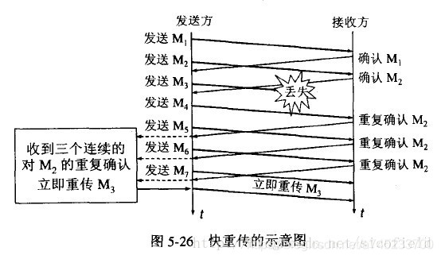

# 一、Java基础 44 道

1. 解释下什么是面向对象？面向对象和面向过程的区别？ 

2. 面向对象的三大特性？分别解释下？ 

3. JDK、JRE、JVM 三者之间的关系？ 

4. 重载和重写的区别？ 

5. Java 中是否可以重写一个 private 或者 static 方法？ 

6. 构造方法有哪些特性？ 

7. 在 Java 中定义一个不做事且没有参数的构造方法有什么作用？ 

8. Java 中创建对象的几种方式？ 

9. 抽象类和接口有什么区别？ 

10. 静态变量和实例变量的区别？ 

11. 12、short s1 = 1；s1 = s1 + 1；有什么错？那么 short s1 = 1; s1 += 1；呢？有没有错误？ 

12. Integer 和 int 的区别？ 

13. 装箱和拆箱的区别 

14. switch 语句能否作用在 byte 上，能否作用在 long 上，能否作用在 String 上？ 

15. 16、final、finally、finalize 的区别 

16. == 和 equals 的区别？ 

17. 两个对象的 hashCode() 相同，则 equals() 也一定为 true 吗？ 

18. 为什么重写 equals() 就一定要重写 hashCode() 方法？ 

19. & 和 && 的区别？ 

20. Java 中的参数传递时传值呢？还是传引用？ 

21. Java 中的 Math.round(-1.5) 等于多少？ 

22. 如何实现对象的克隆？ 

23. 深克隆和浅克隆的区别？ 

24. 什么是 Java 的序列化，如何实现 Java 的序列化？ 

25. 什么情况下需要序列化？ 

26. Java 的泛型是如何工作的 ? 什么是类型擦除 ? 

27. 什么是泛型中的限定通配符和非限定通配符 ? 

28. List 和 List 之间有什么区别 ? 

29. Java 中的反射是什么意思？有哪些应用场景？ 

30. 反射的优缺点？ 

31. Java 中的动态代理是什么？有哪些应用？ 

32. 怎么实现动态代理？ 

33. static 关键字的作用？ 

34. super 关键字的作用？ 

35. 字节和字符的区别？ 

36. String 为什么要设计为不可变类？ 

37. String、StringBuilder、StringBuffer 的区别？ 

38. String 字符串修改实现的原理？ 

39. String str = "i" 与 String str = new String("i") 一样吗？ 

40. String 类的常用方法都有那些？ 

41. final 修饰 StringBuffer 后还可以 append 吗？ 

42. Java 中的 IO 流的分类？说出几个你熟悉的实现类？ 

43. 字节流和字符流有什么区别？ 

44. BIO、NIO、AIO 有什么区别？ 


#  二、Java异常 9 道 

 1. finally 块中的代码什么时候被执行？  

2. finally 是不是一定会被执行到？ 

3. try-catch-finally 中，如果 catch 中 return 了，finally 还会执行吗？ 

4. try-catch-finally 中那个部分可以省略？ 

5. Error 和 Exception 的区别？ 

6. 运行时异常与受检异常有何异同？ 

7. throw 和 throws 的区别？ 

8. 常见的异常类有哪些？ 

9. 主线程可以捕获到子线程的异常吗？    
   

#  三、Java集合 24 道 

1. Java 中常用的容器有哪些？  

2. ArrayList 和 LinkedList 的区别？ 

3. ArrayList 实现 RandomAccess 接口有何作用？为何 LinkedList 却没实现这个接口？ 

4. ArrayList 的扩容机制？ 

5. Array 和 ArrayList 有何区别？什么时候更适合用 Array？ 

6. HashMap 的实现原理/底层数据结构？JDK1.7 和 JDK1.8 

7. HashMap 的 put 方法的执行过程？ 

8. HashMap 的 get 方法的执行过程？ 

9. HashMap 的 resize 方法的执行过程？ 

10. HashMap 的 size 为什么必须是 2 的整数次方？ 

11. HashMap 多线程死循环问题？ 

12. HashMap 的 get 方法能否判断某个元素是否在 map 中？ 

13. HashMap 与 HashTable 的区别是什么？ 

14. HashMap 与 ConcurrentHashMap 的区别是什么? 

15. HashTable 和 ConcurrentHashMap 的区别？ 

16. ConcurrentHashMap 的实现原理是什么？ 

17. HashSet 的实现原理？ 

18. HashSet 怎么保证元素不重复的？ 

19. LinkedHashMap 的实现原理? 

20. Iterator 怎么使用？有什么特点？ 

21. Iterator 和 ListIterator 有什么区别？ 

22. Iterator 和 Enumeration 接口的区别？ 

23. fail-fast 与 fail-safe 有什么区别？ 

24. Collection 和 Collections 有什么区别？ 

   


#  四、Java并发 42 道 

 1. 并行和并发有什么区别？  

2. 线程和进程的区别？ 

3. 守护线程是什么？ 

4. 创建线程的几种方式？ 

5. Runnable 和 Callable 有什么区别？ 

6. 线程状态及转换？ 

7. sleep() 和 wait() 的区别？ 

8. 线程的 run() 和 start() 有什么区别？ 

9. 在 Java 程序中怎么保证多线程的运行安全？ 

10. Java 线程同步的几种方法？ 

11. Thread.interrupt() 方法的工作原理是什么？ 

12. 谈谈对 ThreadLocal 的理解？ 

13. 在哪些场景下会使用到 ThreadLocal？ 

14. 说一说自己对于 synchronized 关键字的了解？ 

15. 如何在项目中使用 synchronized 的？ 

16. 说说 JDK1.6 之后的 synchronized 关键字底层做了哪些优化，可以详细介绍一下这些优化吗？ 

17. 谈谈 synchronized 和 ReenTrantLock 的区别？ 

18. synchronized 和 volatile 的区别是什么？ 

19. 谈一下你对 volatile 关键字的理解？ 

20. 说下对 ReentrantReadWriteLock 的理解？ 

21. 说下对悲观锁和乐观锁的理解？ 

22. 乐观锁常见的两种实现方式是什么？ 

23. 乐观锁的缺点有哪些？ 

24. CAS 和 synchronized 的使用场景？ 

25. 简单说下对 Java 中的原子类的理解？ 

26. atomic 的原理是什么？ 

27. 说下对同步器 AQS 的理解？ 

28. AQS 的原理是什么？ 

29. AQS 对资源的共享模式有哪些？ 

30. AQS 底层使用了模板方法模式，你能说出几个需要重写的方法吗？ 

31. 说下对信号量 Semaphore 的理解？ 

32. CountDownLatch 和 CyclicBarrier 有什么区别？ 

33. 说下对线程池的理解？为什么要使用线程池？ 

34. 创建线程池的参数有哪些？ 

35. 如何创建线程池？ 

36. 线程池中的的线程数一般怎么设置？需要考虑哪些问题？ 

37. 执行 execute() 方法和 submit() 方法的区别是什么呢？ 

38. 说下对 Fork和Join 并行计算框架的理解？ 

39. JDK 中提供了哪些并发容器？ 

40. 谈谈对 CopyOnWriteArrayList 的理解？ 

41. 谈谈对 BlockingQueue 的理解？分别有哪些实现类？ 

42. 谈谈对 ConcurrentSkipListMap 的理解？ 

   


#  五、Java JVM 42 道 

 1. 说一下 Jvm 的主要组成部分？及其作用？  

2. 谈谈对运行时数据区的理解？ 

3. 堆和栈的区别是什么？ 

4. 堆中存什么？栈中存什么？ 

5. 为什么要把堆和栈区分出来呢？栈中不是也可以存储数据吗？ 

6. Java 中的参数传递时传值呢？还是传引用？ 

7. Java 对象的大小是怎么计算的？ 

8. 对象的访问定位的两种方式？ 

9. 判断垃圾可以回收的方法有哪些？ 

10. 垃圾回收是从哪里开始的呢？ 

11. 被标记为垃圾的对象一定会被回收吗？ 

12. 谈谈对 Java 中引用的了解？ 

13. 谈谈对内存泄漏的理解？ 

14. 内存泄露的根本原因是什么？ 

15. 举几个可能发生内存泄漏的情况？ 

16. 尽量避免内存泄漏的方法？ 

17. 常用的垃圾收集[算法]()有哪些？ 

18. 为什么要采用分代收集[算法]()？ 

19. 分代收集下的年轻代和老年代应该采用什么样的垃圾回收[算法]()？ 

20. 什么是浮动垃圾？ 

21. 什么是内存碎片？如何解决？ 

22. 常用的垃圾收集器有哪些？ 

23. 谈谈你对 CMS 垃圾收集器的理解？ 

24. 谈谈你对 G1 收集器的理解？ 

25. 说下你对垃圾回收策略的理解/垃圾回收时机？ 

26. 谈谈你对内存分配的理解？大对象怎么分配？空间分配担保？ 

27. 说下你用过的 JVM 监控工具？ 

28. 如何利用监控工具调优？ 

29. JVM 的一些参数？ 

30. 谈谈你对类文件结构的理解？有哪些部分组成？ 

31. 谈谈你对类加载机制的了解？ 

32. 类加载各阶段的作用分别是什么？ 

33. 有哪些类加载器？分别有什么作用？ 

34. 类与类加载器的关系? 

35. 谈谈你对双亲委派模型的理解？工作过程？为什么要使用 

36. 怎么实现一个自定义的类加载器？需要注意什么？ 

37. 怎么打破双亲委派模型？ 

38. 有哪些实际场景是需要打破双亲委派模型的？ 

39. 谈谈你对编译期优化和运行期优化的理解？ 

40. 为何 HotSpot 虚拟机要使用解释器与编译器并存的架构？ 

41. 说下你对 Java 内存模型的理解？ 

42. 内存间的交互操作有哪些？需要满足什么规则？ 

   


#  六、SSM框架 37 道 

 1. 使用 Spring 框架的好处是什么？  

2. 解释下什么是 AOP？ 

3. AOP 的代理有哪几种方式？ 

4. 怎么实现 JDK 动态代理？ 

5. AOP 的基本概念：切面、连接点、切入点等？ 

6. 通知类型（Advice）型（Advice）有哪些？ 

7. 谈谈你对 IOC 的理解？ 

8. Bean 的生命周期？ 

9. Bean 的作用域? 

10. Spring 中的单例 Bean 的线程安全问题了解吗？ 

11. 谈谈你对 Spring 中的事物的理解？ 

12. Spring 中的事务隔离级别？ 

13. Spring 中的事物传播行为？ 

14. Spring 常用的注入方式有哪些？ 

15. Spring 框架中用到了哪些设计模式？ 

16. ApplicationContext 通常的实现有哪些? 

17. 谈谈你对 MVC 模式的理解？ 

18. SpringMVC 的工作原理/执行流程？ 

19. SpringMVC 的核心组件有哪些？ 

20. SpringMVC 常用的注解有哪些？ 

21. [@RequestMapping]() 的作用是什么？ 

22. 如何解决 POST 请求中文乱码问题，GET 的又如何处理呢？ 

23. SpringMVC 的控制器是不是单例模式，如果是会有什么问题，怎么解决？ 

24. SpringMVC 怎么样设定重定向和转发的？ 

25. SpringMVC 里面拦截器是怎么写的？ 

26. SpringMVC 和 Struts2 的区别有哪些? 

27. 谈谈你对 MyBatis 的理解？ 

28. MyBaits 的优缺点有哪些？ 

29. MyBatis 与 Hibernate 有哪些不同？ 

30. MyBatis 中 #{} 和 ${}的区别是什么？ 

31. MyBatis 是如何进行分页的？分页插件的原理是什么？ 

32. MyBatis 有几种分页方式？ 

33. MyBatis 逻辑分页和物理分页的区别是什么？ 

34. MyBatis 是否支持延迟加载？如果支持，它的实现原理是什么？ 

35. 说一下 MyBatis 的一级缓存和二级缓存？ 

36. Mybatis 有哪些执行器（Executor）？ 

37. MyBatis 动态 SQL 是做什么的？都有哪些动态 SQL？能简述一下动态 SQL的执行原理不？ 

  


#  七、MySQL 31 道 

 1. 请说下你对 MySQL 架构的了解？  

2. 一条 SQL 语句在数据库框架中的执行流程？ 

3. 数据库的三范式是什么？ 

4. char 和 varchar 的区别？ 

5. varchar(10) 和 varchar(20) 的区别？ 

6. 谈谈你对索引的理解？ 

7. 索引的底层使用的是什么数据结构？ 

8. 谈谈你对 B+ 树的理解？ 

9. 为什么 InnoDB 存储引擎选用 B+ 树而不是 B 树呢？ 

10. 谈谈你对聚簇索引的理解？ 

11. 谈谈你对哈希索引的理解？ 

12. 谈谈你对覆盖索引的认识？ 

13. 索引的分类？ 

14. 谈谈你对最左前缀原则的理解？ 

15. 怎么知道创建的索引有没有被使用到？或者说怎么才可以知道这条语句运行很慢的原因? 

16. 什么情况下索引会失效？即查询不走索引？ 

17. 查询性能的优化方法？ 

18. InnoDB 和 MyISAM 的比较？ 

19. 谈谈你对水平切分和垂直切分的理解？ 

20. 主从复制中涉及到哪三个线程？ 

21. 主从同步的延迟原因及解决办法？ 

22. 谈谈你对数据库读写分离的理解？ 

23. 请你描述下事务的特性？ 

24. 谈谈你对事务隔离级别的理解？ 

25. 解释下什么叫脏读、不可重复读和幻读？ 

26. MySQL 默认的隔离级别是什么？ 

27. 谈谈你对MVCC 的了解？ 

28. 说一下 MySQL 的行锁和表锁？ 

29. InnoDB 存储引擎的锁的[算法]()有哪些？ 

30. MySQL 问题排查都有哪些手段？ 

31. MySQL 数据库 CPU 飙升到 500% 的话他怎么处理？ 

 


#  八、Redis 12 道 

 1. 谈下你对 Redis 的了解？  

2. Redis 一般都有哪些使用场景？ 

3. Redis 有哪些常见的功能？ 

4. Redis 支持的数据类型有哪些？ 

5. Redis 为什么这么快？ 

6. 什么是缓存穿透？怎么解决？ 

7. 什么是缓存雪崩？该如何解决？ 

8. 怎么保证缓存和数据库数据的一致性？ 

9. Redis 持久化有几种方式？ 

10. Redis 怎么实现分布式锁？ 

11. Redis 淘汰策略有哪些？ 

12. Redis 常见性能问题和解决方案？ 


 


#  九、计算机网络  

 1. ## TCP为什么需要三次握手？两次不行？ 

     	

    ​	TCP/IP 协议是传输层的一个面向连接的安全可靠的一个传输协议，三次握手的机制是为了保证能建立一个安全可靠的连接，那么第一次握手是由客户端发起，客户端会向服务端发送一个报文，在报文里面：SYN标志位置为1，表示发起新的连接。此时客户端处于 SYN_Sent 状态，等待服务端确认。 当服务端收到这个报文之后就知道客户端要和我建立一个新的连接，于是服务端会为这个TCP 连接分配缓存和变量（缓存指的是一个字节流队列），然后向客户端发送一个确认消息包，在这个消息包里面：ACK标志位置为1，表示确认客户端发起的第一次连接请求。 此时服务端进入SYN_REVD状态。 第三次握手就是当客户端收到服务端发送的确认响应报文之后，还要继续去给服务端进行回应，也是一个ack标志位置1的确认消息。通过以上三次连接，不管是客户端还是服务端，都知道我既能给对方发送消息，也能收到对方的响应。那么，这个连接就被安全的建了。  

    ###  **为什么不是两次握手？**

    ​	（1）因为在这两次握手之后，对于客户端来说，自己发送消息、接收服务端消息，服务端发送消息的功能都没有问题，但是对于服务器，只知道客户端发送消息、自己接受消息的功能没有问题，自己发送的消息客户端有没有收到，能不能正常发送消息，服务器是不知道的，因此需要客户端的第三次握手来确认。

     	（2）三次握手还可以防止已失效的连接请求报文段突然又传送到了服务端，导致服务器错误地建立连接，浪费服务端的连接资源。 客户端发出的第一个连接请求报文段并没有丢失，而是在某个网络结点长时间的滞留了，以致延误到连接释放以后的某个时间才到达Server。本来这是一个早已失效的报文段，但Server收到此失效的连接请求报文段后：

    ​	① 假设不采用“三次握手”，那么只要Sever发出确认，新的连接就建立了。但由于现在Client并没有发出建立连接的请求，因此不会理睬Server的确认，也不会向Server发送数据。而Server却以为新的连接已经建立，并一直等待Client发来数据，这样，Server的很多资源就白白浪费掉了

    ​	② 而采用“三次握手”协议，只要Server收不到来自Client的确认，就知道Client并没有要求建立请求，就不会建立连接了。
    

2. ## TCP为什么需要四次挥手？三次不行？ 

   ​	 	第一次挥手客户端会发起一个报文，在报文里面FIN标志位置1；当服务端收到这报文之后，我就知道了客户端想要和我断开连接，但是此时服务端不一定能做好准备，因为当客户端发起断开连接的时候，对于服务端而言它极有可能有未发送完的的消息，它还要继续发送；

   ​	第二次挥手对于服务端而言他只能进行一个消息确认，我先告诉服务端，我知道你要和我断开连接了，但是我这还可能没有做好准备，你还需要等我一下，等会我会告诉你；

   ```
   	发完这个消息确认包后，服务端进CLOSE_WAIT状态，此时TCP连接处于半关闭状态，即客户端不能向服务端发送报文，只能接收，但服务端仍然可以向客户端发送数据。 
   	服务端收到 FIN 报文后，由FIN=1 知道客户端请求关闭连接，则返回确认报文  客户端收到服务端的确认后，进入 FIN_WAIT2 状态，等待服务端发出的连接释放报文段。
   ```

   ​	第三次挥手，可能稍作片刻，它可能会继续发送一个断开连接的报文，一个FIN位置1的报文，是由服务端发给客户端的，这个报文表示了服务端已经做好了断开连接的准备， 用于关闭服务端到客户端的数据传送。此时服务器处于 LAST_ACK 状态 。

   ​	第四次挥手， 客户端收到 FIN 报文后，发送给服务端一个 ACK 报文作为应答。发送之后，客户端处于 TIME_WAIT状态，如果服务端接收到这个数据包，则进入CLOSED状态，完成四次挥手。

   ​	通过这四次的相互沟通和连接，我就知道了，不管是服务端还是客户端都已经做好了断开连接的准备，于是连接就可以被断开了。

   

   ### **为什么不是三次挥手？**

   ​	TCP 是全双工模式，并且支持半关闭特性，提供了连接的一端在结束发送后还能接收来自另一端数据的能力。任何一方都可以在数据传送结束后发出连接释放的通知，待对方确认后进入半关闭状态。当另一方也没有数据再发送的时候，则发出连接释放通知，对方确认后就完全关闭了 TCP 连接。

   通俗的来说，两次握手就可以释放一端到另一端的 TCP 连接，完全释放连接一共需要四次握手。
   

   这是我对三次握手和四次挥手的理解。

    

   ### **为什么需要 TIME_WAIT 状态？** 

   ​	TIME_WAIT 状态持续 2MSL（最大报文存活时间），约4分钟才转换成CLOSE状态。由于TIME_WAIT 的时间会非常长，因此服务端应尽量减少主动关闭连接，TIME_WAIT 的主要作用有：

   ```
   （1）重发丢失的 ACK 报文，保证连接可靠的关闭：
   
   由于网络等原因，无法保证最后一次挥手的 ACK 报文一定能传送给对方，如果 ACK 丢失，对方会超时重传 FIN，主动关闭端会再次响应ACK过去；如果没有 TIME_WAIT 状态，直接关闭，对方重传的FIN报文则被响应一个RST报文，此RST会被动关闭端被解析成错误。同时，服务器就因为接收不到客户端的信息而无法正常关闭。
   
   （2）保证本次连接的重复数据段从网络中消失：
   
   如果存在两个连接，第一个连接正常关闭，第二个相同的连接紧接着建立；如果第一个连接的某些数据仍然滞留在网络中，这些延迟数据在建立新连接之后才到达，则会干扰第二连接，等待 2MSL 可以让上次连接的报文数据消逝在网络中。
   ```

   

3. ## TCP与UDP有哪些区别？各自应用场景？

   ###  **TCP与UDP有哪些区别**

   （1）TCP是面向字节流的，基本传输单位是TCP报文段；UDP是面向报文的，基本传输单位是是用户数据报；

   ```
   面向字节流：
   	应用程序和TCP的交互是一次一个数据块（大小不等），但TCP把应用程序看成是一连串的无结构的字节流。TCP有一个缓冲，当应用程序传送的数据块太长，TCP就可以把它划分短一些再传送。
   	
   面向报文：
   	面向报文的传输方式是应用层交给UDP多长的报文，UDP就照样发送。因此，应用程序必须选择合适大小的报文。
   ```


   （2）TCP 注重安全可靠性，连接双方在进行通信前，需进行三次握手建立连接。UDP 是无连接的，使用最大努力交付，即不保证可靠交付。

   （3）UDP 不需要连接等待，所以数据传输快，而 TCP 传输效率相对较低

   （4）TCP首部开销是20个字节；UDP的首部开销是8个字节，这也是减少网络传输开销的一方面

   （5）TCP有拥塞控制和流量控制，而UDP没有拥塞控制和流量控制

   （6）TCP支持点对点通信，提供全双工通信，不提供广播或多播服务；UDP支持一对一、一对多、多对一、多对多的通信模式。

   ```
   TCP对应的协议：
   
   FTP：文件传输协议，使用21端口
   Telnet：远程终端接入，使用23端口，用户可以以自己的身份远程连接到计算机上，可提供基于DOS模式下的通信服务。
   SMTP：邮件传送协议，用于发送邮件，使用25端口
   POP3：邮件传送协议，P用于接收邮件。使用110端口
   HTTP：万维网超文本传输协议，是从Web服务器传输超文本到本地浏览器的传送协议
   
   UDP对应的协议：
   DNS：域名解析服务，将域名地址转换为IP地址，使用53号端口；
   SNMP：网络管理协议，用来管理网络设备，使用161号端口；
   TFTP：简单文件传输协议，提供不复杂、开销不大的文件传输服务，使用 69 端口；
   NFS：远程文件服务器
   RIP：路由信息协议
   DHCP：动态主机配置协议
   IGMP：网际组管理协议
   ```

   ### **各自应用场景**

   （1）当对网络通讯质量要求不高时，并且要求网络通讯速度能尽量的快，这时就可以使用UDP。比如即使通信： 语音、 视频 、直播等

   （2）当对网络通讯质量有要求时，要求整个数据准确无误可靠的传递给对方，这时就适用使用 TCP 协议，一般用于文件传输、发送和接收邮件等场景。比如HTTP、HTTPS、FTP等传输文件的协议，POP、SMTP等邮件传输的协议都是使用 TCP 协议

   

4. ## 什么是SYN洪泛？

   ​      SYN 洪泛是指利用 TCP 需要三次握手的特性，攻击者伪造 SYN 报文向服务器发起连接，服务器在收到报文后用 ACK 应答，但之后攻击者不再对该响应进行应答，造成一个半连接。假设攻击者发送大量这样的报文，那么被攻击主机就会造成大量的半连接，耗尽其资源，导致正常的 SYN 请求因为队列满而被丢弃，使得正常用户无法访问。

   ```
   半连接队列：
   	服务器第一次收到客户端的 SYN 之后，就会处于 SYN_RCVD 状态，此时双方还没有完全建立其连接，服务器会把这种状态下的请求连接放在一个队列里，我们把这种队列称之为半连接队列。当然还有一个全连接队列，完成三次握手后建立起的连接就会放在全连接队列中。
   
   ```

   

5. ## 三次握手过程中是否可以携带数据？

   第三次握手时是可以携带数据的，但第一二次握手时不可以携带数据。

   （1）假如第一次握手可以携带数据的话，那么会放大 SYN 洪泛。如果有人要恶意攻击服务器，每次都在第一次握手中的 SYN 报文中放入大量的数据，然后疯狂重复发送 SYN 报文的话，就会让服务器开辟大量的缓存来接收这些报文，内存会很容易耗尽，从而拒绝服务。

   （2） 第三次握手时客户端已经处于 ESTABLISHED 状态，对于客户端来说，他已经建立起连接了，并且已经知道服务器的接收和发送能力是正常的，所以也就可以携带数据了
   

6. ## 什么是粘包和拆包？ 

   拆包粘包在数据链路层、网络层以及传输层都可能存在。而在传输层中，由于UDP有消息保护边界，不会发生粘包拆包问题，因此粘包拆包问题只发生在TCP协议中。TCP是个“流”协议，所谓流，就是没有界限的一串数据。TCP底层并不了解上层业务数据的具体含义，它会根据TCP缓冲区的实际情况进行包的划分，所以在业务上认为，一个完整的包可能会被TCP拆分成多个包进行发送，也有可能把多个小的包封装成一个大的数据包发送，这就是所谓的TCP粘包和拆包问题。
   

7. ## TCP 黏包和拆包是怎么产生的？ 

   （1）应用程序 write 写入的数据字节大于套接口发送缓冲区大小，将会发生拆包现象；

   （2）应用程序 write 写入的数据字节小于套接字缓冲区大小，网卡将应用多次写入的数据发送到网络上，这将会发生粘包。

   （3）进行MSS大小的TCP分段：程序需要发送的数据大小和TCP报文段能发送MSS（Maximum Segment Size，最大报文长度）是不一样的。大于MSS时，就需要把程序数据拆分为多个TCP报文段，称之为拆包；小于时，则要考虑合并多个程序数据为一个TCP报文段，则是粘包；其中 MSS = TCP报文段长度-TCP首部长度。

   （4）接收方法不及时读取套接字缓冲区数据，这将发生粘包。
   

8. ## 怎么解决拆包和粘包？ 

   （1）在数据尾部增加一个特殊字符进行分割，例如 FTP 协议；

   （2）将数据大小设置为固定的，如果数据长度不够，则使用空位补全；

   （3）将数据分为两部分，消息头和消息体；其中消息头大小固定，且包含一个字段声明内容体的大小

 9. ## TCP 如何保证可靠性传输？

    （1）三次握手

    （2）应答机制与超时重传：TCP接收端收到发送端的数据时，它将发送一个确认。当TCP发送端发出一个报文段后，它会启动一个定时器，等待接收端的确认报文段，如果不能及时收到一个确认，将重发这个报文段。

    （3）数据包校验与丢弃重复数据：TCP会检测数据在传输过程中的任何变化，若校验出包有错，则丢弃报文段并且不给出响应，这时TCP会超时重发数据；对于重复数据，则进行丢弃；

    （4）对失序数据包进行重排序：既然TCP报文段作为IP数据报来传输，而IP数据报的到达可能会失序，因此TCP报文段的到达也可能会失序。TCP将对失序数据进行重新排序，然后才交给应用层；

    （5）流量控制：TCP 连接的每一方都有固定大小的缓冲空间。TCP 的接收端只允许另一端发送接收端缓冲区所能接纳的数据，防止较快主机致使较慢主机的缓冲区溢出。TCP使用的流量控制协议是可变大小的滑动窗口协议。

    （6）拥塞控制：网络拥塞时，减少数据的发送。

 10. ## 什么是TCP的流量控制？

     ​	所谓流量控制就是让发送方的发送速率不要太快，让接收方来得及接收。因为如果发送方把数据发送得过快，接收方可能会来不及接收，这就会造成数据的丢失。TCP的流量控制是通过大小可变的滑动窗口来实现的。接收端将自己可以接收的缓冲区大小放入TCP首部中的“窗口大小”字段，通过ACK报文来通知发送端，滑动窗口是接收端用来控制发送端发送数据的大小，从而达到流量控制

     ​	其实发送方的窗口上限，是取值拥塞窗口和滑动窗口两者的最小值。当滑动窗口为 0 时，发送方一般不能再发送数据包，但有两种情况除外，一种情况是可以发送紧急数据，例如，允许用户终止在远端机上的运行进程。另一种情况是发送方可以发送一个 1 字节的数据报来通知接收方重新声明它希望接收的下一字节及发送方的滑动窗口大小。

     设A向B发送数据。在连接建立时，B告诉了A：“我的接收窗口是 rwnd = 400 ”(这里的 rwnd 表示 receiver window) 。因此，发送方的发送窗口不能超过接收方给出的接收窗口的数值。假设每一个报文段为100字节长，而数据报文段序号的初始值设为1。

     

     从图中可以看出，B进行了三次流量控制。第一次把窗口减少到 rwnd = 300 ，第二次又减到了 rwnd = 100 ，最后减到 rwnd = 0 ，即不允许发送方再发送数据了。这种使发送方暂停发送的状态将持续到主机B重新发出一个新的窗口值为止。B向A发送的三个报文段都设置了 ACK = 1 ，只有在 ACK=1 时确认号字段才有意义。

     

11. ## 什么是TCP的拥塞控制？有哪些算法？

    ​	拥塞控制就是防止过多的数据注入网络中，使网络中的路由器或链路不致过载。发送方维持一个拥塞窗口cwnd 的状态变量。拥塞窗口的大小动态变化，取决于网络的拥塞程度，发送方让自己的发送窗口等于拥塞窗口。只要网络没有出现拥塞，拥塞窗口就再增大一些，以便把更多的分组发送出去。但只要网络出现拥塞，拥塞窗口就减小一些，以减少注入到网络中的分组数。 拥塞控制的方法主要有以下几种：慢启动、拥塞避免、快重传和快恢复。

    ### （1）慢开始算法：

    ​	当发送主机开始发送数据时，不要一开始就发送大量的数据，因为不清楚网络的拥塞情况，而是试探一下网络的拥塞情况，由小到大逐渐增大发送窗口。在开始发送报文段时先设置cwnd=1，使得发送方在开始时只发送一个报文段，然后每经过一个传输轮次RTT，拥塞窗口 cwnd 就加倍。另外，为了防止拥塞窗口cwnd增长过大引起网络拥塞，还需要设置一个慢开始门限 ssthresh 状态变量。

    当 cwnd < ssthresh 时，使用上述的慢开始算法。

    当 cwnd = ssthresh 时，既可使用慢开始算法，也可使用拥塞控制避免算法。

    当 cwnd > ssthresh 时，停止使用慢开始算法而改用拥塞避免算法。

    ### （2）拥塞避免算法：

    ​	让拥塞窗口cwnd缓慢地增大，即每经过一个往返时间RTT就把发送方的拥塞窗口cwnd加1。这样拥塞窗口cwnd按线性规律缓慢增长，比慢开始算法的拥塞窗口增长速率缓慢得多。

    ​	无论在慢开始阶段还是在拥塞避免阶段，只要网络出现拥塞（其根据就是没有收到确认），就要把慢开始门限ssthresh设置为出现拥塞时的拥塞窗口值的一半（但不能小于2）。然后把拥塞窗口cwnd 设置为1，执行慢开始算法。这样做的目的就是要迅速减少主机发送到网络中的数据量，使得发生拥塞的路由器有足够时间把队列中积压的数据处理完毕。过程图如下：

    ​	

    ### （3）快重传算法：

    ​		快重传要求接收方在收到一个失序的报文段后就立即发出重复确认（使发送方及早知道有报文段没有到达对方）而不必等到自己发送数据时捎带确认。发送方只要一连收到三个重复确认就应当立即重传对方尚未收到的报文段，而不必继续等待设置的重传计时器时间到期。

    ​		接收方收到了M1和M2后都分别发出了确认。现在假定接收方没有收到M3但接着收到了M4。显然，接收方不能确认M4，因为M4是收到的失序报文段。根据可靠传输原理，接收方可以什么都不做，也可以在适当时机发送一次对M2的确认。但按照快重传算法的规定，接收方应及时发送对M2的重复确认，这样做可以让 发送方及早知道报文段M3没有到达接收方。发送方接着发送了M5和M6。接收方收到这两个报文后，也还要再次发出对M2的重复确认。这样，发送方共收到了 接收方的四个对M2的确认，其中后三个都是重复确认。

    

    ### （4）快恢复算法：

    ​	与快重传配合使用的还有快恢复算法，当发送方连续收到三个重复确认时，就执行“乘法减少”算法，把ssthresh门限设置为拥塞窗口cwnd的一半，但是接下去并不执行慢开始算法，而是将cwnd设置为ssthresh的大小，然后执行拥塞避免算法：因为如果网络出现拥塞的话，就不会收到好几个重复的确认，所以发送方现在认为网络可能没有出现拥塞，所以此时并不执行慢开始算法，而是执行拥塞避免算法。

    

      

    

12. ## 拥塞控制和流量控制的差别：

    （1）相同点：拥塞控制和流量控制的相同点都是控制丢包现象，实现机制都是让发送方发得慢一点。

    （2）不同点：

    ​	① 拥塞控制是一个全局性的过程，防止过多的数据注入到网络中，造成网络拥塞

    ​	② 流量控制指点对点通信量的控制，要做的就是控制发送端发送数据的速率，以便使接收端来得及接受。

13. HTTP1.0，1.1，2.0 的版本区别 

14. POST和GET有哪些区别？各自应用场景？ 

15. HTTP 哪些常用的状态码及使用场景？ 

16. HTTP状态码301和302的区别，都有哪些用途？ 

17. 在交互过程中如果数据传送完了，还不想断开连接怎么办，怎么维持？ 

18. HTTP 如何实现长连接？在什么时候会超时？ 

19. TCP 如何保证有效传输及拥塞控制原理 

20. IP地址有哪些分类？ 

21. GET请求中URL编码的意义 

22. 什么是SQL 注入？举个例子？ 

23. 谈一谈 XSS 攻击，举个例子？ 

24. 讲一下网络五层模型，每一层的职责？ 

25. 简单说下 HTTPS 和 HTTP 的区别 

26. 对称加密与非对称加密的区别 

27. 简单说下每一层对应的网络协议有哪些？ 

28. ARP 协议的工作原理？ 

29. TCP 的主要特点是什么？ 

30. UDP 的主要特点是什么？ 

31. TCP 和 UDP 分别对应的常见应用层协议有哪些？ 

32. 为什么 TIME-WAIT 状态必须等待 2MSL 的时间呢？ 

33. 保活计时器的作用？ 

34. TCP 协议是如何保证可靠传输的？ 

35. 谈谈你对停止等待协议的理解？ 

36. 谈谈你对 ARQ 协议的理解？ 

37. 谈谈你对滑动窗口的了解？ 

38. 谈下你对流量控制的理解？ 

39. 谈下你对 TCP 拥塞控制的理解？使用了哪些[算法]()？ 

40. forward 和 redirect 的区别？ 

41. HTTP 方法有哪些？ 

42. 在浏览器中输入 URL 地址到显示主页的过程？ 

43. DNS 的解析过程？ 

44. 谈谈你对域名缓存的了解？ 

45. 谈下你对 HTTP 长连接和短连接的理解？分别应用于哪些场景？ 

46. HTTPS 的工作过程？ 

47. HTTP 和 HTTPS 的区别？ 

48. HTTPS 的优缺点？ 

49. 什么是数字签名？ 

50. 什么是数字证书？ 

51. Cookie 和 Session 有什么区别？ 

  


#  十、操作系统 32 道 

 1. 简单说下你对并发和并行的理解？  

2. 同步、异步、阻塞、非阻塞的概念 

3. 进程和线程的基本概念 

4. 进程与线程的区别？ 

5. 为什么有了进程，还要有线程呢？ 

6. 进程的状态转换 

7. 进程间的通信方式有哪些？ 

8. 进程的调度[算法]()有哪些？ 

9. 什么是死锁？ 

10. 产生死锁的原因？ 

11. 死锁产生的必要条件？ 

12. 解决死锁的基本方法？ 

13. 怎么预防死锁？ 

14. 怎么避免死锁？ 

15. 怎么解除死锁？ 

16. 什么是缓冲区溢出？有什么危害？ 

17. 分页与分段的区别？ 

18. 物理地址、逻辑地址、虚拟内存的概念 

19. 页面置换[算法]()有哪些？ 

20. 谈谈你对动态链接库和静态链接库的理解？ 

21. 外中断和异常有什么区别？ 

22. 一个程序从开始运行到结束的完整过程，你能说出来多少？ 

23. 什么是用户态和内核态 

24. 用户态和内核态是如何切换的？ 

25. 进程终止的方式 

26. 守护进程、僵尸进程和孤儿进程 

27. 如何避免僵尸进程？ 

28. 介绍一下几种典型的锁？ 

29. 常见内存分配内存错误 

30. 内存交换中，被换出的进程保存在哪里？ 

31. 原子操作的是如何实现的 

32. 抖动你知道是什么吗？它也叫颠簸现象 

   


#  十一、消息队列与分布式 26 道 

 1. 消息队列的基本作用？  

2. 消息队列的优缺点有哪些？ 

3. 如何保证消息队列的高可用？ 

4. 如何保证消息不被重复消费？或者说，如何保证消息消费的幂等性？ 

5. 如何保证消息的可靠性传输？或者说，如何处理消息丢失的问题？ 

6. 如何保证消息的顺序性？ 

7. 大量消息在 MQ 里长时间积压，该如何解决？ 

8. MQ 中的消息过期失效了怎么办？ 

9. RabbitMQ 有哪些重要的角色？ 

10. RabbitMQ 有哪些重要的组件？ 

11. RabbitMQ 有几种广播类型？ 

12. Kafka 可以脱离 zoo[keep]()er 单独使用吗？为什么？ 

13. Kafka 有几种数据保留的策略？ 

14. Kafka 的分区策略有哪些？ 

15. 谈下你对 Zoo[keep]()er 的认识？ 

16. Zoo[keep]()er 都有哪些功能？ 

17. 谈下你对 ZAB 协议的了解？ 

18. Zoo[keep]()er 怎么保证主从节点的状态同步？ 

19. Zoo[keep]()er 有几种部署模式？ 

20. 说一下 Zoo[keep]()er 的通知机制？ 

21. 集群中为什么要有主节点？ 

22. 集群中有 3 台服务器，其中一个节点宕机，这个时候 Zoo[keep]()er 还可以使用吗？ 

23. 说一下两阶段提交和三阶段提交的过程？分别有什么问题？ 

24. Zoo[keep]()er 宕机如何处理？ 

25. 说下四种类型的数据节点 Znode？ 

26. Zoo[keep]()er 和 Dubbo 的关系？
